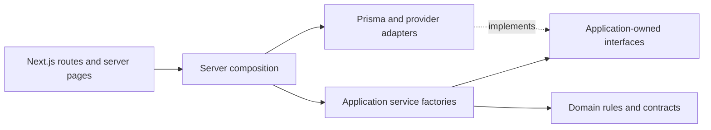

# Architecture

## Repository structure

This is a modular Next.js application in a pnpm workspace. App Router files remain the delivery entrypoints; the tracker SDK and shared contracts remain independent packages.

```text
apps/platform/src/
  app/                       Pages, layouts, API routes, and route-local widget UI
  components/                Reusable dashboard, auth, media, and visual components
  client/calls/              Browser LiveKit session lifecycle and React hook
  lib/                       Browser-safe paths, fetch helpers, navigation, validation
  server/
    domain/                  Role/origin rules, errors, directory contracts, visitor metrics
    application/
      auth/                  Account lookup, local sign-in, and subject-based provisioning
      calls/                 Call lifecycle, history, and media authorization
      chat/                  Conversations and messages
      directory/             User synchronization, eligibility, and reconciliation
      notifications/         Notifications and synchronization
      presence/              Agent availability and visitor presence orchestration
      sites/                 Site management
      tracking/              Tracker bootstrap and engagement
      visitors/              Visitor history and analytics queries
      diagnostics/           Architecture probe
      ports/                 Repository, unit-of-work, and provider interfaces
    composition/             Production wiring; imported only by server delivery entrypoints
    infrastructure/          Prisma, Redis, Upstash, LiveKit, geo-IP, logging, configuration
    interfaces/              Authentication, HTTP responses, public request guards, SSE handling
  test/                      Architecture checks and server-only test shim
packages/shared/             Zod schemas and serializable cross-boundary contracts
packages/tracker-sdk/        Embeddable browser tracker and widgets
prisma/                      Schema, migrations, seed and provisioning scripts
tests/                       Test configurations, browser tests, deployment tests
ops/                         Deployment operations
```

### Dependency rules

- Domain rules depend only on domain code and shared validation/contracts. They do not access Next.js, React, Prisma, Redis, or provider SDKs.
- Application factories coordinate use cases through injected ports. They do not import routes, UI, HTTP/auth interfaces, infrastructure, composition, or concrete provider SDKs.
- Infrastructure implements provider and storage access. It may implement application ports, but must not call application services or delivery code.
- Interfaces adapt HTTP/authentication to application services. Routes validate, authorize, invoke a service, and map the response.
- Reusable components, client hooks, and browser helpers do not import server modules (including composition) or generated Prisma code. Preserve server-only guards and explicit client directives.
- Import concrete modules directly. Do not create a server barrel that can accidentally enter browser bundles.

These boundaries are checked by `apps/platform/src/test/architecture.test.ts` during `pnpm test`, including relative imports and dynamic imports.

### Composition and transaction boundaries

Application modules export `create*Service(dependencies)` factories. Dependencies are explicit, typed repository and provider contracts owned by application/ports. The application layer does not import Prisma, generated database models, provider SDKs, infrastructure, or composition. Services can be exercised with in-memory fakes without configuring PostgreSQL, Redis, or LiveKit.

Server-only composition modules instantiate each service once with production adapters and other use cases. Routes, pages, authentication adapters, and SSE handlers import the composed operations. Repository factories resolve database clients lazily; importing a service does not open a connection. Reusable browser components never import composition modules.



Repository operations have named, typed inputs and plain data results. Prisma selectors, filters, generated model types, raw SQL, and retryable Prisma error classification live in infrastructure. Provider ports cover presence, realtime, media tokens, configuration, location lookup, logging, and directory access. The Next.js cookie/session and request/response adapters remain in interfaces.

The repository `transaction(work, options)` unit of work binds every operation supplied to `work` to the same Prisma transaction. Exceptions propagate to Prisma and roll back the transaction. Application code retains authorization and business decisions inside that callback. Call participant locks, conditional status writes and event inserts preserve their ordering; directory subject/event advisory locks, monotonic revision checks, eligibility checks and receipt writes retain their existing transaction boundaries. No media bytes pass through Next.js.

Directory SSO provisioning and reconciliation share the same injected directory service. The CLI entrypoint is `server/interfaces/cli/reconcile-supernizo-users.ts`; its launcher remains `pnpm directory:reconcile`.

### Extending and validating the architecture

1. Add pure rules to domain and use-case orchestration to an application factory.
2. Define a narrow, provider-independent contract in application/ports. Keep database query syntax and generated types out of the contract.
3. Implement persistence and external calls in infrastructure; preserve transaction and idempotency requirements.
4. Wire the adapter in server/composition, and call the composed use case from the delivery entrypoint after validation and authorization.
5. Test policy with injected fakes, adapter semantics with repository tests, and HTTP behavior with route tests.

Tests remain beside their code. The architecture suite enforces domain isolation, application dependency inversion, infrastructure direction, browser boundaries, and the absence of direct database imports in routes/pages/interfaces. Run `pnpm lint`, `pnpm typecheck`, `pnpm test`, and `pnpm build`. Database integration tests require their configured database and TLS certificate. These dependency changes do not require a database migration.

## Production topology

Supernizo Autocall is a single Next.js and TypeScript application. In production, Docker Compose runs the application and PostgreSQL together on the existing Hetzner host under `/home/deploy/app/autocall`. Nginx terminates public TLS and forwards only `/autocall-db` traffic to the application’s loopback port.

```text
Browser
  |
  | HTTPS https://api.infrastructuresg.com/autocall-db
  v
Existing host Nginx
  | /autocall-db/* -> 127.0.0.1:3200
  v
Next.js app container :3000
  |
  | private Docker network only
  v
PostgreSQL container :5432 -> named persistent volume

Next.js -> Upstash Redis/Realtime over HTTPS
Browsers -> LiveKit over WebRTC after explicit visitor acceptance
```

PostgreSQL has no host port and no public URL. It is reachable only as `postgres:5432` from the private Compose network. The Next.js host port binds to `127.0.0.1`, so it can be reached by host Nginx but not directly from the Internet. The separate `Supernizo-Autocall-Database` repository is not part of or modified by this deployment.

## Service boundaries

| Concern                   | Service               | Boundary                                                                                                             |
| ------------------------- | --------------------- | -------------------------------------------------------------------------------------------------------------------- |
| UI and HTTP APIs          | Next.js App Router    | Server Components by default. Route Handlers validate and authorize requests, call services, and map safe responses. |
| Durable data              | PostgreSQL and Prisma | Configuration, users, visitors, sessions, events, conversations, calls, scores, and audit records.                   |
| Presence                  | Upstash Redis         | Short-lived presence, heartbeats, connection state, and expiry; it is not durable history.                           |
| Realtime application push | Upstash Realtime/SSE  | Dashboard updates, chat delivery, and ringing events through the internal realtime adapter.                          |
| Voice/video               | LiveKit               | Browsers connect directly to LiveKit after consent. Next.js issues scoped tokens and never proxies media.            |

## Deployment flow

Pull requests targeting `hetzner-prod` run lint, type-checking, unit tests, PostgreSQL repository tests, migrations, and the production build in GitHub Actions. A successful push to `hetzner-prod` also connects to Hetzner using a pinned SSH host key and asks the fixed server checkout to deploy that exact reviewed commit.

The server deploy script validates its protected environment file, builds immutable commit-tagged app and migration images locally, starts PostgreSQL, applies committed Prisma migrations once, and replaces the application container. If the app fails its PostgreSQL readiness check, the previous app image is restored when it is still present. Redis health is reported separately so a transient external-provider failure does not replace an otherwise healthy application during deployment. Database migrations are never automatically reversed.

Automatic Vercel Git deployments are disabled only for commits on `hetzner-prod` in both supported project-root configurations. Deployments from `main` and other source branches remain enabled. Vercel matches this setting against the commit's source branch, so a preview for a feature branch may still run when that branch has a pull request targeting `hetzner-prod`; the merge commit on `hetzner-prod` does not deploy to Vercel. GitHub Actions and Hetzner remain the automatic deployment path for `hetzner-prod`.

## Security boundaries

- Only Nginx ports 80/443 and the restricted SSH service need public host access. PostgreSQL is never published.
- Database, Redis, LiveKit API, authentication, and tracking secrets remain server-only.
- Public tracker endpoints validate the site public key, allowed origin, payload schema, and rate limit before business logic runs.
- Raw visitor IP addresses are not stored by default. Approximate location is accepted only from explicitly trusted reverse-proxy headers.
- Production `.env.production` is stored only on Hetzner with mode `0600`, never in GitHub or an image.
- Media requires visitor acceptance and browser permission. V1 does not record media.

See `docs/hetzner-deployment.md` for the host bootstrap, Nginx, GitHub Actions, backup, restore, and deployment procedures.
